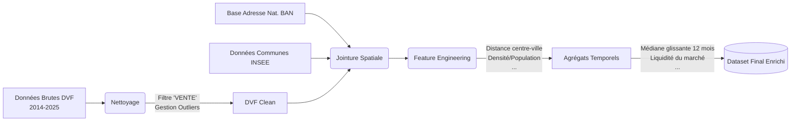

# 🏠 ML vs Deep Learning : Estimation de Valeur Foncière

[👉 Une démo ici](https://ml-vs-dl-property-pricing-demo.streamlit.app/)

## 1. Contexte & Objectif

Ce projet compare l'efficacité de deux paradigmes sur les données immobilières françaises :
- Un modèle de **Machine Learning** classique (LightGBM) reconnu pour son efficacité sur les données tabulaires.
- Une architecture **Deep Learning** (FT-Transformer) utilisant des mécanismes d'attention (Feature Tokenization).

## 2. ⚙️ Pipeline de Données : Extraction, Nettoyage et Enrichissement

Un des défis a été de traiter et d'enrichir la base de données publique DVF (Demandes de Valeurs Foncières) contenant plus de 13,4 millions de transactions entre 2014 et 2025.

Pour cela, les données sont traitées par chunks et on les stocke sous format parquet.

De plus, les modèles sont entrainés avec des données enrichies par des sources extérieurs et des agrégats.

## 3. 🧠 Modélisation et Architectures
### LigthGBM
Modèle léger mais puissant, un encodage ordinal est effectué pour les variables catégorielles. 

La target (prix de vente) suivant une distribution asymétrique, on considère son log lors de l'apprentissage.

### FT-Transformer
- Feature Tokenizer : Les variables numériques subissent une projection linéaire, et les variables catégorielles passent par une couche d'Embedding avant d'être concaténées avec un token [CLS].
- Imputation et Scaling : Remplacement des valeurs manquantes géographiques par la médiane locale (INSEE) et normalisation StandardScaler (Z-score).

Entraîné sur GPU (Batch 256), le modèle a convergé avec un mécanisme d'Early Stopping à l'epoch 44 pour éviter le sur-apprentissage.

## 4. 📊 Évaluation et Métriques

Pour simuler des conditions réelles, le modèle a été entraîné sur la période 2014 - oct. 2023, et testé sur les transactions récentes (à partir de nov. 2023). La métrique principale retenue est la MAE (Mean Absolute Error).

Résultats Globaux :
- LightGBM : MAE de ~68 041 €. (Très bonnes performances sur les biens < 500k€).
- FT-Transformer : MAE de ~69 808 €.

    
  
