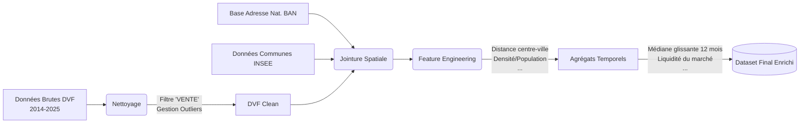
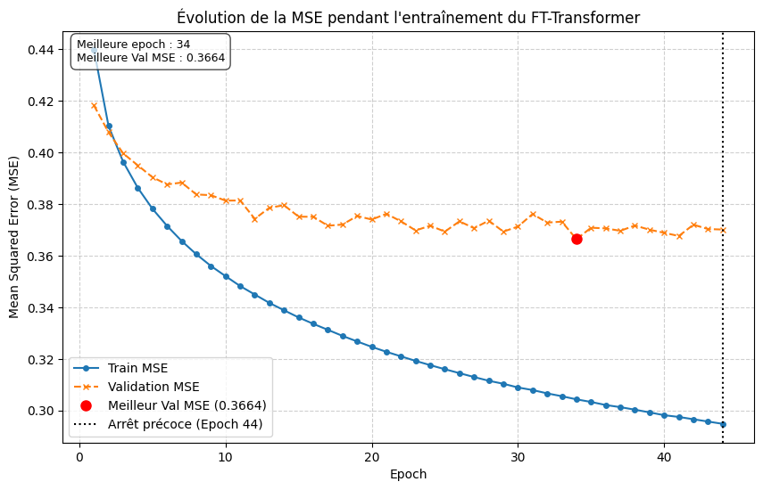
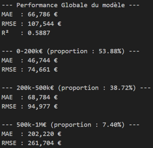
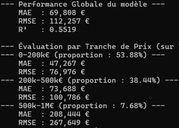
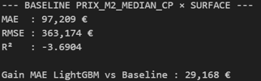

# 🏠 ML vs Deep Learning : Estimation de Valeur Foncière

[👉 Une démo ici](https://ml-vs-dl-property-pricing-demo.streamlit.app/)

## 1. Contexte & Objectif

Ce projet compare l'efficacité de deux paradigmes sur les données immobilières françaises :
- Un modèle de **Machine Learning** classique (LightGBM) reconnu pour son efficacité sur les données tabulaires.
- Une architecture **Deep Learning** (FT-Transformer) utilisant des mécanismes d'attention (Feature Tokenization).

## 2. ⚙️ Pipeline de Données

Un des défis a été de traiter et d'enrichir la base de données publique DVF (Demandes de Valeurs Foncières) contenant plus de 13,4 millions de transactions entre 2014 et 2025.

Pour cela, les données sont traitées par chunks et on les stocke sous format parquet.

De plus, les modèles sont entrainés avec des données enrichies par des sources extérieurs et des agrégats.

## 3. 🧠 Modélisation et Architectures
### LigthGBM
Modèle léger mais puissant, un encodage ordinal est effectué pour les variables catégorielles. 

La target (prix de vente) suivant une distribution asymétrique, on considère son log lors de l'apprentissage.

### FT-Transformer
- Feature Tokenizer : Les variables numériques subissent une projection linéaire, et les variables catégorielles passent par une couche d'Embedding avant d'être concaténées avec un token [CLS].
- Imputation et Scaling : Remplacement des valeurs manquantes géographiques par la médiane locale (INSEE) et normalisation StandardScaler (Z-score).

Entraîné sur GPU (Batch 256), le modèle a convergé avec un mécanisme d'Early Stopping à l'epoch 44 pour éviter le sur-apprentissage.

## 4. 📊 Évaluation et Métriques

Pour simuler des conditions réelles, le modèle a été entraîné sur la période 2014 - oct. 2023, et testé sur les transactions récentes (à partir de nov. 2023). La métrique principale retenue est la MAE (Mean Absolute Error).

Résultats Globaux :
- LightGBM : MAE de ~68 041 €. (Très bonnes performances sur les biens < 500k€).
- FT-Transformer : MAE de ~69 808 €.

<table style="width: 100%;">
  <tr>
    <td style="width: 50%; text-align: center;">
      
       
      <em>Métriques finales du LightGBM</em>
    </td>
    <td style="width: 50%; text-align: center;">
      
       
      <em>Métriques finales du FT-Transformers</em>
    </td>
    <td style="width: 50%; text-align: center;">
      
       
      <em>Métriques d'une baseline naïve   (Surface × Prix Médian local)</em>
    </td>
  </tr>
</table>

Face à une baseline naïve (Surface × Prix Médian local), le ML permet un gain massif de ~29 000€ d'erreur moyenne.

**Mise en perspective** : Bien que le FT-Transformer ait des résultats très proches du Boosting, c'est un modèle qui est bien plus complexe à déployer et surtout beacoup plus long à entraîner que LightGBM. 

## 5. 🚀 Mise en Production

Pour rendre l'inférence accessible, le modèle est déployé via une interface Streamlit.

Afin de garantir son fonctionnement même sans l'hébergement de la lourde base de données historique de 13 millions de lignes, une mécanique de Fallback est implémentée. Si l'API ne trouve pas l'historique d'un code postal, le système simule des agrégats réalistes basés sur la géographie départementale, permettant à la démonstration de ne jamais crasher.

## 6. 🔍 Limites et Perspectives
L'erreur moyenne actuelle est relativement correcte : elle permet une analyse macroéconomique mais reste bient trop élevée pour l'estimation granulaire d'un particulier.

Plusieurs pistes d'amélioration sont clairement identifiées :

1. Absence de données essentielles : Les modèles n'ont pas accès à des données protégées non disponibles en Open Data (intérieur du bien, photos, descriptions détaillées...). D'autres données abstentes mais pertinentes peuvent tout de même être récoltées : chômage par zone, nuisances sonores, etc.

2. Approche Ensembliste : Créer un Comité d'Experts combinant LightGBM, FT-Transformer et d'autres architectures (ResNet) permettrait de lisser et stabiliser la prédiction finale.

3. Prévision temporelle pure : Remplacer le modèle hédonique par une architecture série temporelle (LSTM ou Temporal Fusion Transformer) permettrait de prédire l'évolution future des prix.
  
